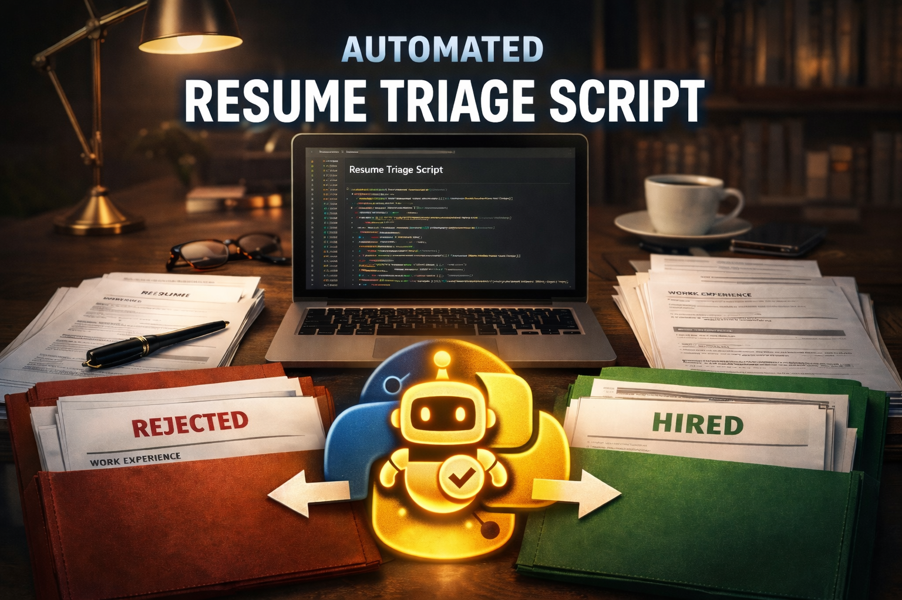

# Resume Screening Tool (PDF) - DevOps Requirements

A local, offline Python utility that screens a folder of PDF CVs against strict DevOps criteria,
generates a detailed report, produces a formatted Excel sheet, and sorts CVs into
Passed/Failed/Ambiguous folders.



## Features

- Batch process all `.pdf` files in a given folder.
- Hard requirements:
  - "Kubernetes" must appear in the Experience content (not just Skills).
  - "AWS" must appear in the Experience content (not just Skills).
  - Candidate must have >= 3 years of DevOps-only experience.
  - Any entries mentioning ITI/NTI/Sprints/DEPI (and full institute names) are excluded.
- Evidence included:
  - Page number and a short snippet showing Kubernetes/AWS matches (when found).
  - DevOps roles counted and how much time was counted (overlap-safe).
  - Excluded entries listed.
- Outputs:
  - `screening_results.csv`
  - `screening_results.xlsx` (formatted + color-coded Result column)
  - `screening_report.md`
  - `passed_cvs/`, `failed_cvs/`, `ambiguous_cvs/`
- Offline-first: no external APIs or internet calls.
- OCR fallback (optional) for scanned PDFs if installed.

## Requirements

### Runtime

- Python 3.9+
- macOS / Linux / Windows (OCR dependencies vary by OS)

### Python dependencies

- `PyMuPDF` (PDF text extraction)
- `openpyxl` (Excel output formatting)

Optional (only for OCR fallback):

- `pytesseract`
- `Pillow`
- System `tesseract` binary installed

## Installation

Create and activate a virtual environment (recommended):

```bash
python3 -m venv .venv
source .venv/bin/activate
```

Install required packages:

```bash
pip3 install -r requirements.txt
```

Optional OCR packages:

```bash
pip3 install pytesseract pillow
```

If you want OCR to work, install the system tesseract binary:

- macOS (Homebrew): `brew install tesseract`
- Ubuntu/Debian: `sudo apt-get install tesseract-ocr`
- Windows: install via the official installer and ensure `tesseract` is on PATH

## Usage

Place all Resume PDFs in a folder (example: `./cvs`), then run:

```bash
python3 screen_cvs.py ./cvs --output-dir ./out
```

### Arguments

- `folder` (positional, optional): folder containing PDF CVs (default: `./cvs`)
- `--output-dir` (optional): output directory for reports/files/folders (default: current directory)

## Output Structure

If you use `--output-dir ./out`, the tool will create:

```text
out/
  screening_results.csv
  screening_results.xlsx
  screening_report.md
  passed_cvs/
  failed_cvs/
  ambiguous_cvs/
```

## Screening Logic (Detailed)

### 1) Kubernetes requirement (Experience-only)

A candidate must have the word "Kubernetes" inside experience entries extracted from the Resume.
If it appears only in Skills (or outside extracted experience entries), the candidate fails.

### 2) AWS requirement (Experience-only)

A candidate must have the word "AWS" inside experience entries extracted from the Resume.
If it appears only in Skills (or outside extracted experience entries), the candidate fails.

### 3) DevOps-only experience requirement (>= 3 years)

The tool calculates DevOps experience in unique months to avoid double counting overlapping roles.

A role is counted as DevOps-related if the entry contains one or more DevOps keywords, such as:
DevOps, SRE, Kubernetes, Terraform, CI/CD, Jenkins, GitHub Actions, Helm, EKS, Docker, Argo CD, etc.

Total DevOps time is computed as:

```
devops_years = (unique_devops_months / 12)  # rounded to 2 decimals
```

A candidate passes this criterion only if:

- `devops_years >= 3.0`, and
- there is no date ambiguity

### 4) Excluding training/institute entries (ITI/NTI/Sprints/DEPI)

Any experience entry mentioning:

- ITI, NTI, Sprints, DEPI
- Information Technology Institute
- National Technology Institute

is ignored entirely:

- It does not count toward DevOps experience
- It cannot be used as evidence for AWS/Kubernetes

This is implemented using word-boundary regex, preventing false matches like "certification"
containing "iti".

## Ambiguity Handling

A Resume is considered Ambiguous when date parsing is uncertain (e.g., year-only dates like
2021 - 2023, unclear formats, etc.).

In such cases:

- The tool will sort the PDF into `ambiguous_cvs/`
- The Excel result will show `AMBIGUOUS`
- The candidate cannot PASS (strict rule: no ambiguity allowed for pass)

## Notes / Known Limitations

- PDF text order can be inconsistent depending on how the PDF was authored.
  This tool uses date-range-based extraction and a heading-based fallback to mitigate that.
- If a Resume is heavily graphical or scanned, OCR may be required.
  If OCR dependencies are not installed, such CVs may be marked ambiguous or missed.
- "Experience section" is interpreted as experience entries extracted from the Resume.
  This is more robust than relying solely on headings, which can appear out of order in text extraction.

## Troubleshooting

### 1) AWS/Kubernetes not detected despite being present

- The PDF may be scanned -> enable OCR dependencies.
- The Resume may use unusual formatting; check `screening_report.md` to see how many
  experience entries were detected (`experience_entries_found`).

### 2) OCR not running

Ensure you installed:

- `pytesseract`, `Pillow`
- system `tesseract` binary

Verify:

```bash
tesseract --version
```

### 3) Excel file not generated

Ensure `openpyxl` is installed:

```bash
pip show openpyxl
```

## Security & Privacy

This tool runs locally and does not upload Resume content anywhere.
No external API calls are made.

Output files may contain Resume snippets; handle outputs according to your organization's policies.

## License

Apache License 2.0. See `LICENSE`.
